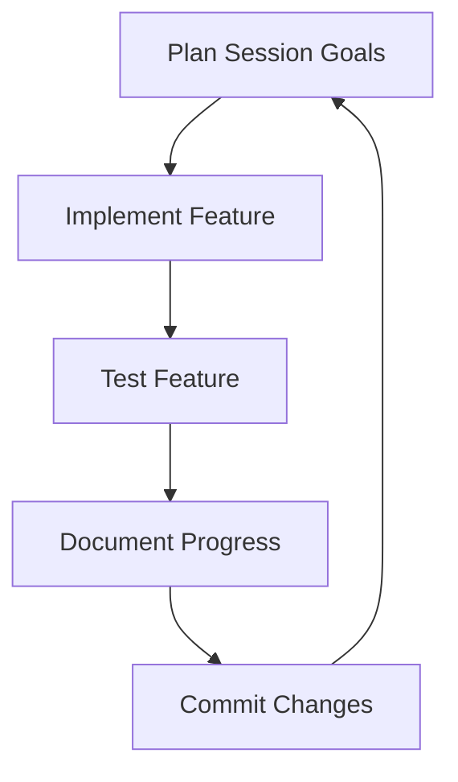

# Tower of Babel

[towerofbabel_boxart2](https://github.com/user-attachments/assets/41adc48e-903a-4eb1-afe6-f6bba6c04097)

> *Climb the Tower of Babel with your AI companion, Lute the Bard, in this unique roguelike adventure.*

[](https://www.gnu.org/licenses/gpl-3.0)
[](https://github.com/machinepilot/angband)
[](https://angband.github.io/angband/)

## 🔍 Overview

Tower of Babel is an AI-augmented roguelike game built on Angband 4.2.5. Explore 100 unique "ringdoms" as you ascend the tower, accompanied by your AI-driven bard companion who narrates your journey with dynamic storytelling. This project combines traditional roguelike elements (procedural generation, permadeath, turn-based combat) with cutting-edge AI to create a unique gameplay experience.

This repository serves as a **complete project workbench** for AI-assisted game development, documenting every step of the process from initial concept to playable game.

### Key Features

- **Vertical Exploration**: 100 procedurally generated floors ("ringdoms"), each with unique themes and challenges
- **AI Companion**: Lute the Bard, an AI-driven character who narrates your actions and evolves with you
- **Faction System**: Build relationships with various factions that affect your journey
- **Local AI Integration**: Uses lightweight LLMs for dynamic storytelling while respecting your privacy

## 🏗️ Development Approach

This project uses an AI-assisted iterative development cycle, with each work session focusing on specific, testable goals. The process follows these principles:

1. **Small, Testable Iterations**: Each development session targets specific, achievable goals
2. **Test-Driven Development**: Features are validated with tests before moving forward
3. **Documentation First**: Design decisions and implementation details are documented here
4. **AI Collaboration**: Leveraging Claude as a development partner while building AI game mechanics

### Development Loop



## 📚 Project Documentation

### Game Design

- [Game Overview](#game-overview)
- [Setting](#setting)
- [Core Mechanics](#core-mechanics)
- [The Bard: Lute](#the-bard-lute)
- [Model Context Protocol](#model-context-protocol)
- [Factions](#factions)
- [Gameplay Loop](#gameplay-loop)

### Technical Architecture

- [Development Tools](#development-tools)
- [Core Game Components](#core-game-components)
- [Bard System Architecture](#bard-system-architecture)
- [LLM Integration](#llm-integration)
- [Programming Tips](#programming-tips)

## 🚀 Getting Started

### Prerequisites

- C development environment (GCC, Make, CMake)
- Python 3.8+ (for MCP server)
- Git
- [Ollama](https://ollama.ai/) for local LLM deployment

### Installation

```bash
# Clone the repository
git clone https://github.com/machinepilot/angband.git
cd angband

# Set up build environment
mkdir build && cd build
cmake ..
make

# Install required Python packages
pip install -r requirements.txt

# Download the Llama3 model via Ollama
ollama pull llama3:8b
```

### Running the Game

```bash
# Start the MCP server
python server/mcp_server.py

# In another terminal, run the game
cd build
./tower_of_babel
```

## 📝 Development Log

The development log tracks progress, decisions, and lessons learned throughout the project:

| Date | Milestone | Description |
|------|-----------|-------------|
| 2025-03-07 | Project Initiation | Fork of Angband, initial design document created |
| 2025-03-08 | MCP Prototype | Basic Model Context Protocol implementation |
| ... | ... | ... |

## 📋 Task Board

- [x] Fork Angband repository
- [x] Create initial design document
- [ ] Set up development environment
- [ ] Implement basic Bard structure
- [ ] Create MCP server prototype
- [ ] Modify level generation for first ringdom
- [ ] Implement basic narration system
- [ ] Add test framework
- [ ] Create first playable prototype

---

# Game Design Document

## Game Overview

This is a turn-based roguelike set in the **Tower of Babel**, a 100-floor megastructure where players control a **climber** seeking a lost companion. The game blends classic roguelike elements—procedural generation, permadeath, and inventory management—with a unique AI companion, **Lute the Bard**, who narrates the journey and adapts to player actions via a local AI model. Built on a fork of *Angband*, this design enhances gameplay with dynamic storytelling and faction interactions.

### Key Features
- **Premise**: Ascend the tower, floor by floor, to reunite with a lost companion.
- **Objective**: Reach floor 100 and defeat a final boss (e.g., a corrupt ruler).
- **Unique Element**: Lute, an AI-driven Bard, narrates actions, manages gear, and evolves with the player.

### Base Game Choice
- **Game**: *Angband*
- **Reason**:
  - **Modular Code**: Written in C, with files like `generate.c` (level generation) and `player.c` (player mechanics) easy to modify.
  - **Mechanics Fit**: Offers turn-based combat, permadeath, and procedural levels—perfect for this project.
  - **Support**: Active community with resources (e.g., GitHub repository).
- **Modding Plan**: Fork *Angband* to integrate Lute, the Model Context Protocol (MCP), and new systems.

## Setting

The **Tower of Babel** is a sprawling, vertical world with 100 procedurally generated floors, called **ringdoms**, each with unique themes and static landmarks.

### Floor Design
- **Size**: 100x100 tile grid—larger than *Angband*'s default for richer exploration.
- **Generation**:
  - **Algorithm**: Modified room-and-corridor system from `generate.c`.
  - **Process**: Rooms (size varies by theme) connect via corridors, with hazards and NPCs placed dynamically.
- **Static Elements** (consistent across runs):
  - **Airship Dock**: 5x5 tiles at (50,50) for NPC interactions.
  - **Outer Wall Door**: 3x3 tiles at (0,50), locked until a key is found.
  - **Docked Airship**: 7x3 tiles at (75,25), searchable for loot.

### Example Ringdoms
| Floor | Name          | Theme                | Features                          | Hazards                  |
|-------|---------------|----------------------|-----------------------------------|--------------------------|
| 1     | The Ringdom   | Marketplace          | Gondolas (10x10), Traders (5-10)  | Pickpockets (10% chance) |
| 3     | The Parlor    | Decadent Halls       | Ballroom (20x20), Masked NPCs     | Secret Rooms (10% spawn) |
| 5     | The Baths     | Steamy Caves         | Hot Springs (3x3, +5 HP)          | Steam Vents (10 damage)  |
| 7     | The Windlass  | Industrial Zone      | Gears (40x40), Automatons (5-7)   | Steam Vents (10 damage)  |
| 10    | The Heart     | Political Hub        | Throne Room (50x50), Leaders      | Guarded Doors (5x5)      |

### Narrative Goal
- **Mission**: Find a lost companion (e.g., a friend or spouse).
- **Progression**: Clues unfold via Lute's narration and ringdom interactions.

## Core Mechanics

These mechanics form the game's foundation, expanded from *Angband*'s systems.

### Turn-Based System
- **Flow**: Player acts (move, attack, etc.), then enemies respond.
- **Clock**: Each action adds 1 unit to the game clock, triggering events (e.g., NPC departure after 50 turns).
- **Code**: Managed in `game-world.c`.

### Combat
- **Hit Check**: Roll $d20 + \text{Attribute}$ vs. enemy defense.
  - **Example**: Strength 10 + roll 12 = 22 vs. Defense 15 → Hit.
- **Damage**: $ \text{Attribute} + d6 - \text{Enemy Armor} $.
  - **Example**: Strength 10 + roll 4 - Armor 2 = 12 damage.
- **Attributes**:
  - **Strength**: Melee damage.
  - **Agility**: Dodge and ranged attacks.
  - **Intellect**: Social or magic (expandable).
- **Enemy Example**: Gear Golem (HP 50, Defense 18, Attack 12).
- **Code**: Extended in `player-attack.c` and `mon-attack.c`.

### Inventory
- **Player**: 10 slots (e.g., sword, potion = 1 slot each).
- **Lute's Bag**: 5-10 slots (randomized at start).
  - **Access**: 1 turn; 5% failure chance in combat (roll $d100 < 5$) → item drops.
- **Actions**: Drop, swap, or transfer items.
- **Code**: Updated in `item.c`.

### Permadeath
- **Rule**: HP = 0 → run ends, save file deleted.
- **Save Points**: Auto-save on floor exit (in `save.c`).

### Procedural Generation
- **Method**: Rooms and corridors themed by ringdom.
- **Static Integration**: Hardcoded features (e.g., docks) ensure consistency.
- **Code**: Enhanced in `generate.c`.

## The Bard: Lute

Lute is an AI companion who narrates, assists, and grows with the player.

### Structure
```c
struct bard {
    int courage;          // 0-100
    int perception;       // 1-20
    int lore;             // 1-20
    struct item bag[10];  // 5-10 slots
    struct event memory[10]; // Event log
    char narration[256];  // Narration text
};
```

### Spawn
- Random spot on floor 1 (e.g., (10,10)).
- Starting Stats: Courage 50, Perception 1, Lore 1.

### Features

#### Narration
- **Trigger**: Every action (e.g., "You strike the golem—sparks fly!").
- **Process**: Game state → MCP → AI → narration text.
- **Code**: `bard_narrate()` in `bard.c`.

#### Memory
- **Capacity**: 10 events (FIFO queue).
- **Event Format**: {type: "combat", floor: 2, detail: "killed golem"}.
- **Use**: 50% chance per turn to reference memory (e.g., "Another golem—like old times!").
- **Code**: `bard_memory_update()`, `bard_memory_check()`.

#### Courage
- **Range**: 0-100 (starts at 50).
- **Updates**:
  - Kill enemy: +10
  - Quest done: +5
  - Hit taken: -15
  - Flee: -10
- **Effect**: Courage ≥ 75 → Lute distracts enemy (10% miss chance, once per floor).
- **Code**: `bard_courage_update()`, `bard_courage_action()`.

#### Inventory
- **Slots**: 5-10 (randomized).
- **Access**: 1 turn; 5% fumble risk in combat.
- **Code**: `bard_inventory_access()`.

#### Knowledge
- **Stats**: Perception (relics), Lore (texts).
- **Growth**: +1 per floor, max 20.
- **Check**: d20 + (Perception + Lore) vs. DC (e.g., 15).
- **Success**: Reveals bonuses (e.g., +5 attack) or clues.
- **Code**: `bard_knowledge_roll()`.

#### AI Integration
- **Model**: Llama 3 via Ollama (local, 4GB RAM).
- **Input**: JSON (e.g., {floor: 5, action: "attack", health: 50}).
- **Output**: 256-character narration.
- **Prompt**: "Narrate {action} on {floor}, health {health}, grim tone."
- **Code**: `bard_ai_call()` in `mcp.c`.

## Model Context Protocol (MCP)

The MCP connects the game to Lute's AI for real-time narration.

### Setup
- **Server**: Local Flask app at 127.0.0.1:5000.
- **Code Example**:
```python
from flask import Flask, request
import ollama

app = Flask(__name__)

@app.route('/narrate', methods=['POST'])
def narrate():
    data = request.json
    prompt = f"Narrate {data['action']} on floor {data['floor']}"
    response = ollama.generate(model='llama3', prompt=prompt)
    return {'text': response['text']}

app.run(port=5000)
```

### Data Flow
1. Game sends JSON (e.g., {action: "kill", enemy: "golem"}).
2. MCP forwards to Llama 3.
3. AI returns narration (e.g., "The golem crumbles—iron bends!").
4. Game displays it.

### Caching
- **Preload**: 5 narrations per floor.
- **Refresh**: Every 10 turns or major event.
- **Goal**: <0.1s latency.

## Factions

Factions add replayability and social dynamics.

### Structure
- **Persistent**:
  - **Mechanimists**: Tech-focused (The Windlass).
  - **Putus Templar**: Zealots (The Parlor).
  - **Barathrumites**: Rebels (scattered).
- **Procedural**: 1-2 per floor (e.g., Steam Cult in The Baths).

### Reputation
- **Range**: -100 to 100 (starts at 0).
- **Changes**:
  - Aid: +20
  - Harm: -30
  - Quest: +15
- **Effects**:
  - ≥ +50: Ally (e.g., NPC aid).
  - ≤ -50: Hostile (attacks on sight).
- **Code**: `faction.c` with `struct faction {name, rep, behavior}`.

### Quests
- **Example**: "Sabotage automaton for 50 gold."
- **Generation**: Via MCP in `faction_quest_generate()`.

## Gameplay Loop

Here's how it feels to play:

1. **Start**: Pick Lute's trait (e.g., +5 Lore), spawn at (10,10) on floor 1.
2. **Explore**: Move across the 100x100 grid, finding items and NPCs. Lute narrates: "A gondola sways—trade awaits."
3. **Fight**: Attack a golem (roll d20 + 10 vs. 18). Lute cheers: "Steel bends to your will!"
4. **Interact**: Persuade an NPC (roll d20 + charisma vs. DC 12). Lute advises: "He's greedy—haggle hard."
5. **Ascend**: Reach stairs at (90,90), climb to the next floor.
6. **End**: Floor 100 → fight boss (HP 200, Attack 25).

---

# Technical Architecture

## Development Tools

### Development Environment

- **Version Control**:
  - **Git** with GitHub repository
  - Branch strategy: `main`, `develop`, `feature/`, `bugfix/`
  - Automated build testing with GitHub Actions

- **Build System**:
  - **CMake** for cross-platform build configuration
  - **Make** for Unix-based platforms
  - **MinGW** support for Windows development

- **IDE Support**:
  - **VSCode** with C/C++ extension
  - **CLion** project files
  - **Code::Blocks** project files for accessibility

- **Testing Framework**:
  - **Check** for C unit testing
  - **Python pytest** for MCP testing
  - Automated test runs on build

- **Documentation**:
  - **Doxygen** for code documentation
  - **Markdown** for design documents and user guides
  - Wiki integration with GitHub

## Core Game Components

- **Base Engine** (Angband Fork):
  - `main-*.c` - Platform-specific main functions
  - `z-*.c` - Low-level utility functions
  - `ui-*.c` - User interface components
  - `obj-*.c` - Object handling
  - `player-*.c` - Player mechanics

- **Modified & New Components**:
  - `generate-ringdom.c` - Enhanced level generation
  - `bard.c/.h` - Lute mechanics
  - `mcp.c/.h` - Model Context Protocol
  - `faction.c/.h` - Faction system
  - `memory.c/.h` - Event memory system

- **External Systems**:
  - MCP Python server (`server.py`)
  - LLM integration layer (`llm_wrapper.py`)
  - Tools for content generation (`content_tools/`)

## Bard System Architecture

### Core Structure

```c
typedef struct event_memory {
    char type[32];         // "combat", "discovery", "dialogue", etc.
    int floor;             // Floor where event occurred
    char detail[128];      // Specific details
    int importance;        // 1-10, affects recall priority
    int timestamp;         // Game turns when recorded
} EventMemory;

typedef struct bard {
    // Core attributes
    int courage;               // 0-100, affects combat support
    int perception;            // 1-20, affects item discovery
    int lore;                  // 1-20, affects lore knowledge
    
    // Dynamic state
    int mood;                  // -100 to 100, affects narration tone
    int relationship;          // 0-100, player relationship
    int energy;                // 0-100, special ability resource
    
    // Inventory system
    int bag_capacity;          // 5-10 slots
    struct object *bag[MAX_BAG_SIZE];
    
    // Memory system
    EventMemory memories[MAX_MEMORIES];
    int memory_count;
    int recent_memory_idx;
    
    // Narration system
    char current_narration[MAX_NARRATION_LENGTH];
    char cached_narrations[CACHE_SIZE][MAX_NARRATION_LENGTH];
    int cache_indices[CACHE_SIZE];  // Game states for cache
    
    // Special abilities
    bool abilities[MAX_ABILITIES];
    int ability_cooldowns[MAX_ABILITIES];
    
    // AI integration
    int prompt_template_idx;   // Current prompt template
    char context_buffer[CONTEXT_BUFFER_SIZE];
    int context_markers[MAX_CONTEXT_MARKERS];
    
    // Statistics for debugging and balancing
    int narrations_generated;
    int cache_hits;
    int abilities_used[MAX_ABILITIES];
    int items_stored;
    int items_retrieved;
} Bard;
```

### Key Systems & Algorithms

#### Memory Management System

```c
void bard_remember_event(Bard *lute, const char *type, int floor, const char *detail, int importance) {
    // Find slot (replace least important or oldest)
    int slot = find_memory_slot(lute);
    
    // Store the new memory
    strncpy(lute->memories[slot].type, type, sizeof(lute->memories[slot].type) - 1);
    lute->memories[slot].floor = floor;
    strncpy(lute->memories[slot].detail, detail, sizeof(lute->memories[slot].detail) - 1);
    lute->memories[slot].importance = importance;
    lute->memories[slot].timestamp = current_game_turn;
    
    // Update memory count and pointer
    if (lute->memory_count < MAX_MEMORIES)
        lute->memory_count++;
    lute->recent_memory_idx = slot;
}

const EventMemory *bard_recall_relevant_memory(Bard *lute, const char *type, int floor) {
    // Probability increases with more similar contexts
    int best_match = -1;
    int best_score = 0;
    
    for (int i = 0; i < lute->memory_count; i++) {
        // Calculate relevance score based on type, recency, location, importance
        int score = calculate_memory_relevance(lute->memories[i], type, floor);
        
        if (score > best_score) {
            best_score = score;
            best_match = i;
        }
    }
    
    // Only recall if score passes threshold (affected by lore attribute)
    if (best_match >= 0 && best_score > (20 - lute->lore) * 5)
        return &lute->memories[best_match];
        
    return NULL;  // No relevant memory found
}
```

#### Narration Caching System

```c
void bard_cache_narration(Bard *lute, int state_hash, const char *narration) {
    // Find LRU cache slot or matching state
    int slot = find_cache_slot(lute, state_hash);
    
    // Store narration and state hash
    strncpy(lute->cached_narrations[slot], narration, MAX_NARRATION_LENGTH - 1);
    lute->cache_indices[slot] = state_hash;
    
    // Update cache statistics
    lute->narrations_generated++;
}

bool bard_get_cached_narration(Bard *lute, int state_hash, char *output, size_t output_size) {
    // Look for matching state in cache
    for (int i = 0; i < CACHE_SIZE; i++) {
        if (lute->cache_indices[i] == state_hash) {
            // Copy cached narration to output
            strncpy(output, lute->cached_narrations[i], output_size - 1);
            output[output_size - 1] = '\0';
            
            // Update cache statistics
            lute->cache_hits++;
            return true;
        }
    }
    
    return false;  // Cache miss
}
```

## LLM Integration

### Recommended Open Source Models

- **Primary Model**: **Llama 3 8B** 
  - Balanced performance and resource usage
  - Small enough to run on modest hardware
  - Strong narrative capabilities

- **Lightweight Alternative**: **Phi-3 Mini (3.8B)**
  - Extremely efficient performance/size ratio
  - Can run on systems with limited RAM (4GB)
  - Faster inference than larger models

- **High-Quality Alternative**: **Mistral 7B Instruct v0.2**
  - Superior narrative quality
  - Good instruction following
  - Slightly larger resource requirements

- **Specialized Option**: **TinyLlama (1.1B)**
  - Ultra-lightweight option
  - Can run on very modest hardware
  - Sacrifices some narrative quality

### Model Optimization Techniques

- **Quantization**:
  - Use 4-bit quantization (GGUF format)
  - Reduces memory footprint by 75% with minimal quality loss
  - Implementation: Ollama supports this natively

- **Context Length Management**:
  - Limit context to 512-1024 tokens
  - Summarize previous context periodically
  - Retain only critical game state information

- **Batched Generation**:
  - Pre-generate common narrations during loading screens
  - Queue non-urgent narrations during high-activity periods

- **Model Splitting**:
  - Use different models for different narrative types
  - Main narration: Llama 3 
  - Lore generation: Mistral
  - Quick responses: TinyLlama

### Prompt Engineering

**Base Template**:
```
You are Lute, a bard in the Tower of Babel. Narrate this moment in the adventure:
- Action: {action}
- Target: {target}
- Current floor: {floor_name} (Floor {floor_number})
- Player health: {health}/{max_health}
- Your mood: {mood_description}

Write 1-2 sentences (maximum 50 words) in a {tone} style that captures this moment.
If referencing a memory, smoothly incorporate: {memory_detail}
```

## Programming Tips

### Memory Management

- **Use Static Buffers**:
  - Pre-allocate fixed-size memory for narrations
  - Avoid dynamic allocation during gameplay
  ```c
  // Good: Static allocation
  char narration_buffer[MAX_NARRATION_LENGTH];
  
  // Avoid: Dynamic allocation during gameplay
  char *narration = malloc(length * sizeof(char));
  ```

- **String Handling Safety**:
  - Always use bounds-checked string functions
  - Apply strlcpy/strlcat instead of strcpy/strcat
  ```c
  // Good: Safe string operations
  strlcpy(dest, src, dest_size);
  
  // Avoid: Unsafe operations
  strcpy(dest, src);  // Can cause buffer overflows
  ```

### Threading & Performance

- **Asynchronous Processing**:
  - Use a worker thread for AI requests to prevent gameplay stutter
  ```c
  pthread_t mcp_thread;
  
  void *mcp_worker(void *arg) {
      MCP_Request *req = (MCP_Request *)arg;
      process_mcp_request(req);
      req->complete = true;
      return NULL;
  }
  
  void queue_mcp_request(const char *action, const char *target) {
      MCP_Request *req = create_mcp_request(action, target);
      pthread_create(&mcp_thread, NULL, mcp_worker, req);
      // Can detach or join later depending on needs
  }
  ```

- **Caching Strategy**:
  - Implement tiered caching (memory and disk)
  - Pre-generate common narrations during load times
  
- **Fallback Mechanisms**:
  - Create template-based narrations as backup
  - Apply degradation strategies when performance issues occur

### AI Integration Robustness

- **Error Recovery**:
  - Implement timeouts for AI requests
  - Provide graceful degradation when AI is unavailable
  
- **State Serialization**:
  - Save and restore MCP state during game save/load
  - Persist memory and narration caches

---

## About the Original Angband

This project is based on Angband 4.2.5, a classic roguelike game. The original README is preserved below:

<details>
<summary>Original Angband README (click to expand)</summary>

# Angband 4.2.5

<p align="center">
  
  
</p>

Angband is a graphical dungeon adventure game that uses textual characters to
represent the walls and floors of a dungeon and the inhabitants therein, in the
vein of games like NetHack and Rogue. If you need help in-game, press `?`.

- **Installing Angband:** See the [Official Website](https://angband.github.io/angband/) or [compile it yourself](https://angband.readthedocs.io/en/latest/hacking/compiling.html).
- **How to Play:** [The Angband Manual](https://angband.readthedocs.io/en/latest/)
- **Getting Help:** [Angband Forums](https://angband.live/forums/)

Enjoy!

-- The Angband Dev Team
</details>

## License

This project is licensed under [GPL v3](LICENSE) - the same license as the original Angband.

## Credits

- Original Angband by [Angband Dev Team](https://angband.github.io/angband/)
- Tower of Babel concept and AI integration by machinepilot
- Development assistance by [Claude AI](https://www.anthropic.com/claude)

---

<p align="center">
  <i>Tower of Babel: Where AI and Roguelike Adventure Converge</i>
</p>
