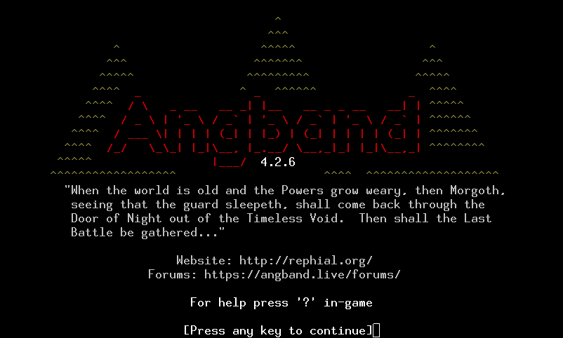

# Angband 4.2.1

  
  

Angband is a graphical dungeon adventure game that uses textual characters to
represent the walls and floors of a dungeon and the inhabitants therein, in the
vein of games like NetHack and Rogue. If you need help in-game, press `?`.

- **Installing Angband:** See the [Official Website](http://rephial.org/) or [compile it yourself](https://angband.readthedocs.io/en/latest/hacking/compiling.html).
- **How to Play:** [The Angband Manual](https://angband.readthedocs.io/en/latest/)
- **Getting Help:** [Angband Forums](http://angband.oook.cz/forum/)

Enjoy!

-- The Angband Dev Team
