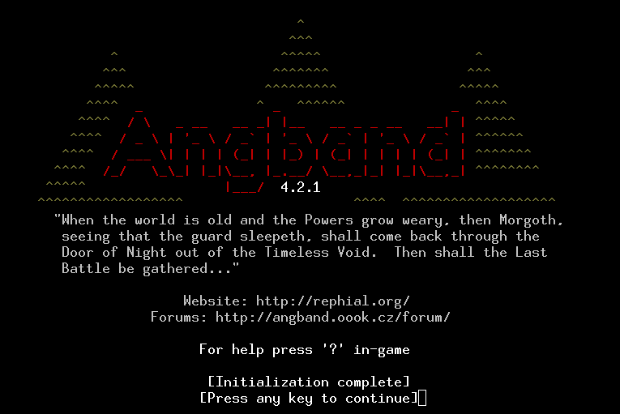

# Tower of Babel


> *Climb the Tower of Babel with your AI companion, Lute the Bard, in this unique roguelike adventure.*

[](https://www.gnu.org/licenses/gpl-3.0)
[](https://github.com/machinepilot/angband)
[](https://angband.github.io/angband/)

## 🔍 Overview

Tower of Babel is an AI-augmented roguelike game built on Angband 4.2.5. Explore 100 unique "ringdoms" as you ascend the tower, accompanied by your AI-driven bard companion who narrates your journey with dynamic storytelling. This project combines traditional roguelike elements (procedural generation, permadeath, turn-based combat) with cutting-edge AI to create a unique gameplay experience.

This repository serves as a **complete project workbench** for AI-assisted game development, documenting every step of the process from initial concept to playable game.

### Key Features

- **Vertical Exploration**: 100 procedurally generated floors ("ringdoms"), each with unique themes and challenges
- **AI Companion**: Lute the Bard, an AI-driven character who narrates your actions and evolves with you
- **Faction System**: Build relationships with various factions that affect your journey
- **Local AI Integration**: Uses lightweight LLMs for dynamic storytelling while respecting your privacy

## 🏗️ Development Approach

This project uses an AI-assisted iterative development cycle, with each work session focusing on specific, testable goals. The process follows these principles:

1. **Small, Testable Iterations**: Each development session targets specific, achievable goals
2. **Test-Driven Development**: Features are validated with tests before moving forward
3. **Documentation First**: Design decisions and implementation details are documented here
4. **AI Collaboration**: Leveraging Claude as a development partner while building AI game mechanics

### Development Loop


## 📚 Project Documentation

### Game Design

- [Game Overview](#game-overview)
- [Setting](#setting)
- [Core Mechanics](#core-mechanics)
- [The Bard: Lute](#the-bard-lute)
- [Model Context Protocol](#model-context-protocol)
- [Factions](#factions)
- [Gameplay Loop](#gameplay-loop)

### Technical Architecture

- [Development Tools](#development-tools)
- [Core Game Components](#core-game-components)
- [Bard System Architecture](#bard-system-architecture)
- [LLM Integration](#llm-integration)
- [Programming Tips](#programming-tips)

## 🚀 Getting Started

### Prerequisites

- C development environment (GCC, Make, CMake)
- Python 3.8+ (for MCP server)
- Git
- [Ollama](https://ollama.ai/) for local LLM deployment

### Installation

```bash
# Clone the repository
git clone https://github.com/machinepilot/angband.git
cd angband

# Set up build environment
mkdir build && cd build
cmake ..
make

# Install required Python packages
pip install -r requirements.txt

# Download the Llama3 model via Ollama
ollama pull llama3:8b
```

### Running the Game

```bash
# Start the MCP server
python server/mcp_server.py

# In another terminal, run the game
cd build
./tower_of_babel
```

## 📝 Development Log

The development log tracks progress, decisions, and lessons learned throughout the project:

| Date | Milestone | Description |
|------|-----------|-------------|
| 2025-03-07 | Project Initiation | Fork of Angband, initial design document created |
| 2025-03-08 | MCP Prototype | Basic Model Context Protocol implementation |
| ... | ... | ... |

## 📋 Task Board

- [x] Fork Angband repository
- [x] Create initial design document
- [ ] Set up development environment
- [ ] Implement basic Bard structure
- [ ] Create MCP server prototype
- [ ] Modify level generation for first ringdom
- [ ] Implement basic narration system
- [ ] Add test framework
- [ ] Create first playable prototype

---

<div align="center">
  <a href="#tower-of-babel-comprehensive-training-plan">
    
  </a>
</div>

---

# Game Design Document

## Game Overview

This is a turn-based roguelike set in the **Tower of Babel**, a 100-floor megastructure where players control a **climber** seeking a lost companion. The game blends classic roguelike elements—procedural generation, permadeath, and inventory management—with a unique AI companion, **Lute the Bard**, who narrates the journey and adapts to player actions via a local AI model. Built on a fork of *Angband*, this design enhances gameplay with dynamic storytelling and faction interactions.

### Key Features
- **Premise**: Ascend the tower, floor by floor, to reunite with a lost companion.
- **Objective**: Reach floor 100 and defeat a final boss (e.g., a corrupt ruler).
- **Unique Element**: Lute, an AI-driven Bard, narrates actions, manages gear, and evolves with the player.

### Base Game Choice
- **Game**: *Angband*
- **Reason**:
  - **Modular Code**: Written in C, with files like `generate.c` (level generation) and `player.c` (player mechanics) easy to modify.
  - **Mechanics Fit**: Offers turn-based combat, permadeath, and procedural levels—perfect for this project.
  - **Support**: Active community with resources (e.g., GitHub repository).
- **Modding Plan**: Fork *Angband* to integrate Lute, the Model Context Protocol (MCP), and new systems.

## Setting

The **Tower of Babel** is a sprawling, vertical world with 100 procedurally generated floors, called **ringdoms**, each with unique themes and static landmarks.

### Floor Design
- **Size**: 100x100 tile grid—larger than *Angband*'s default for richer exploration.
- **Generation**:
  - **Algorithm**: Modified room-and-corridor system from `generate.c`.
  - **Process**: Rooms (size varies by theme) connect via corridors, with hazards and NPCs placed dynamically.
- **Static Elements** (consistent across runs):
  - **Airship Dock**: 5x5 tiles at (50,50) for NPC interactions.
  - **Outer Wall Door**: 3x3 tiles at (0,50), locked until a key is found.
  - **Docked Airship**: 7x3 tiles at (75,25), searchable for loot.

### Example Ringdoms
| Floor | Name          | Theme                | Features                          | Hazards                  |
|-------|---------------|----------------------|-----------------------------------|--------------------------|
| 1     | The Ringdom   | Marketplace          | Gondolas (10x10), Traders (5-10)  | Pickpockets (10% chance) |
| 3     | The Parlor    | Decadent Halls       | Ballroom (20x20), Masked NPCs     | Secret Rooms (10% spawn) |
| 5     | The Baths     | Steamy Caves         | Hot Springs (3x3, +5 HP)          | Steam Vents (10 damage)  |
| 7     | The Windlass  | Industrial Zone      | Gears (40x40), Automatons (5-7)   | Steam Vents (10 damage)  |
| 10    | The Heart     | Political Hub        | Throne Room (50x50), Leaders      | Guarded Doors (5x5)      |

### Narrative Goal
- **Mission**: Find a lost companion (e.g., a friend or spouse).
- **Progression**: Clues unfold via Lute's narration and ringdom interactions.

## Core Mechanics

These mechanics form the game's foundation, expanded from *Angband*'s systems.

### Turn-Based System
- **Flow**: Player acts (move, attack, etc.), then enemies respond.
- **Clock**: Each action adds 1 unit to the game clock, triggering events (e.g., NPC departure after 50 turns).
- **Code**: Managed in `game-world.c`.

### Combat
- **Hit Check**: Roll $d20 + \text{Attribute}$ vs. enemy defense.
  - **Example**: Strength 10 + roll 12 = 22 vs. Defense 15 → Hit.
- **Damage**: $ \text{Attribute} + d6 - \text{Enemy Armor} $.
  - **Example**: Strength 10 + roll 4 - Armor 2 = 12 damage.
- **Attributes**:
  - **Strength**: Melee damage.
  - **Agility**: Dodge and ranged attacks.
  - **Intellect**: Social or magic (expandable).
- **Enemy Example**: Gear Golem (HP 50, Defense 18, Attack 12).
- **Code**: Extended in `player-attack.c` and `mon-attack.c`.

### Inventory
- **Player**: 10 slots (e.g., sword, potion = 1 slot each).
- **Lute's Bag**: 5-10 slots (randomized at start).
  - **Access**: 1 turn; 5% failure chance in combat (roll $d100 < 5$) → item drops.
- **Actions**: Drop, swap, or transfer items.
- **Code**: Updated in `item.c`.

### Permadeath
- **Rule**: HP = 0 → run ends, save file deleted.
- **Save Points**: Auto-save on floor exit (in `save.c`).

### Procedural Generation
- **Method**: Rooms and corridors themed by ringdom.
- **Static Integration**: Hardcoded features (e.g., docks) ensure consistency.
- **Code**: Enhanced in `generate.c`.

## The Bard: Lute

Lute is an AI companion who narrates, assists, and grows with the player.

### Structure
```c
struct bard {
    int courage;          // 0-100
    int perception;       // 1-20
    int lore;             // 1-20
    struct item bag[10];  // 5-10 slots
    struct event memory[10]; // Event log
    char narration[256];  // Narration text
};
```

### Spawn
- Random spot on floor 1 (e.g., (10,10)).
- Starting Stats: Courage 50, Perception 1, Lore 1.

### Features

#### Narration
- **Trigger**: Every action (e.g., "You strike the golem—sparks fly!").
- **Process**: Game state → MCP → AI → narration text.
- **Code**: `bard_narrate()` in `bard.c`.

#### Memory
- **Capacity**: 10 events (FIFO queue).
- **Event Format**: {type: "combat", floor: 2, detail: "killed golem"}.
- **Use**: 50% chance per turn to reference memory (e.g., "Another golem—like old times!").
- **Code**: `bard_memory_update()`, `bard_memory_check()`.

#### Courage
- **Range**: 0-100 (starts at 50).
- **Updates**:
  - Kill enemy: +10
  - Quest done: +5
  - Hit taken: -15
  - Flee: -10
- **Effect**: Courage ≥ 75 → Lute distracts enemy (10% miss chance, once per floor).
- **Code**: `bard_courage_update()`, `bard_courage_action()`.

#### Inventory
- **Slots**: 5-10 (randomized).
- **Access**: 1 turn; 5% fumble risk in combat.
- **Code**: `bard_inventory_access()`.

#### Knowledge
- **Stats**: Perception (relics), Lore (texts).
- **Growth**: +1 per floor, max 20.
- **Check**: d20 + (Perception + Lore) vs. DC (e.g., 15).
- **Success**: Reveals bonuses (e.g., +5 attack) or clues.
- **Code**: `bard_knowledge_roll()`.

#### AI Integration
- **Model**: Llama 3 via Ollama (local, 4GB RAM).
- **Input**: JSON (e.g., {floor: 5, action: "attack", health: 50}).
- **Output**: 256-character narration.
- **Prompt**: "Narrate {action} on {floor}, health {health}, grim tone."
- **Code**: `bard_ai_call()` in `mcp.c`.

## Model Context Protocol (MCP)

The MCP connects the game to Lute's AI for real-time narration.

### Setup
- **Server**: Local Flask app at 127.0.0.1:5000.
- **Code Example**:
```python
from flask import Flask, request
import ollama

app = Flask(__name__)

@app.route('/narrate', methods=['POST'])
def narrate():
    data = request.json
    prompt = f"Narrate {data['action']} on floor {data['floor']}"
    response = ollama.generate(model='llama3', prompt=prompt)
    return {'text': response['text']}

app.run(port=5000)
```

### Data Flow
1. Game sends JSON (e.g., {action: "kill", enemy: "golem"}).
2. MCP forwards to Llama 3.
3. AI returns narration (e.g., "The golem crumbles—iron bends!").
4. Game displays it.

### Caching
- **Preload**: 5 narrations per floor.
- **Refresh**: Every 10 turns or major event.
- **Goal**: <0.1s latency.

## Factions

Factions add replayability and social dynamics.

### Structure
- **Persistent**:
  - **Mechanimists**: Tech-focused (The Windlass).
  - **Putus Templar**: Zealots (The Parlor).
  - **Barathrumites**: Rebels (scattered).
- **Procedural**: 1-2 per floor (e.g., Steam Cult in The Baths).

### Reputation
- **Range**: -100 to 100 (starts at 0).
- **Changes**:
  - Aid: +20
  - Harm: -30
  - Quest: +15
- **Effects**:
  - ≥ +50: Ally (e.g., NPC aid).
  - ≤ -50: Hostile (attacks on sight).
- **Code**: `faction.c` with `struct faction {name, rep, behavior}`.

### Quests
- **Example**: "Sabotage automaton for 50 gold."
- **Generation**: Via MCP in `faction_quest_generate()`.

## Gameplay Loop

Here's how it feels to play:

1. **Start**: Pick Lute's trait (e.g., +5 Lore), spawn at (10,10) on floor 1.
2. **Explore**: Move across the 100x100 grid, finding items and NPCs. Lute narrates: "A gondola sways—trade awaits."
3. **Fight**: Attack a golem (roll d20 + 10 vs. 18). Lute cheers: "Steel bends to your will!"
4. **Interact**: Persuade an NPC (roll d20 + charisma vs. DC 12). Lute advises: "He's greedy—haggle hard."
5. **Ascend**: Reach stairs at (90,90), climb to the next floor.
6. **End**: Floor 100 → fight boss (HP 200, Attack 25).

---

# Technical Architecture

## Development Tools

### Development Environment

- **Version Control**:
  - **Git** with GitHub repository
  - Branch strategy: `main`, `develop`, `feature/`, `bugfix/`
  - Automated build testing with GitHub Actions

- **Build System**:
  - **CMake** for cross-platform build configuration
  - **Make** for Unix-based platforms
  - **MinGW** support for Windows development

- **IDE Support**:
  - **VSCode** with C/C++ extension
  - **CLion** project files
  - **Code::Blocks** project files for accessibility

- **Testing Framework**:
  - **Check** for C unit testing
  - **Python pytest** for MCP testing
  - Automated test runs on build

- **Documentation**:
  - **Doxygen** for code documentation
  - **Markdown** for design documents and user guides
  - Wiki integration with GitHub

## Core Game Components

- **Base Engine** (Angband Fork):
  - `main-*.c` - Platform-specific main functions
  - `z-*.c` - Low-level utility functions
  - `ui-*.c` - User interface components
  - `obj-*.c` - Object handling
  - `player-*.c` - Player mechanics

- **Modified & New Components**:
  - `generate-ringdom.c` - Enhanced level generation
  - `bard.c/.h` - Lute mechanics
  - `mcp.c/.h` - Model Context Protocol
  - `faction.c/.h` - Faction system
  - `memory.c/.h` - Event memory system

- **External Systems**:
  - MCP Python server (`server.py`)
  - LLM integration layer (`llm_wrapper.py`)
  - Tools for content generation (`content_tools/`)

## Bard System Architecture

### Core Structure

```c
typedef struct event_memory {
    char type[32];         // "combat", "discovery", "dialogue", etc.
    int floor;             // Floor where event occurred
    char detail[128];      // Specific details
    int importance;        // 1-10, affects recall priority
    int timestamp;         // Game turns when recorded
} EventMemory;

typedef struct bard {
    // Core attributes
    int courage;               // 0-100, affects combat support
    int perception;            // 1-20, affects item discovery
    int lore;                  // 1-20, affects lore knowledge
    
    // Dynamic state
    int mood;                  // -100 to 100, affects narration tone
    int relationship;          // 0-100, player relationship
    int energy;                // 0-100, special ability resource
    
    // Inventory system
    int bag_capacity;          // 5-10 slots
    struct object *bag[MAX_BAG_SIZE];
    
    // Memory system
    EventMemory memories[MAX_MEMORIES];
    int memory_count;
    int recent_memory_idx;
    
    // Narration system
    char current_narration[MAX_NARRATION_LENGTH];
    char cached_narrations[CACHE_SIZE][MAX_NARRATION_LENGTH];
    int cache_indices[CACHE_SIZE];  // Game states for cache
    
    // Special abilities
    bool abilities[MAX_ABILITIES];
    int ability_cooldowns[MAX_ABILITIES];
    
    // AI integration
    int prompt_template_idx;   // Current prompt template
    char context_buffer[CONTEXT_BUFFER_SIZE];
    int context_markers[MAX_CONTEXT_MARKERS];
    
    // Statistics for debugging and balancing
    int narrations_generated;
    int cache_hits;
    int abilities_used[MAX_ABILITIES];
    int items_stored;
    int items_retrieved;
} Bard;
```

### Key Systems & Algorithms

#### Memory Management System

```c
void bard_remember_event(Bard *lute, const char *type, int floor, const char *detail, int importance) {
    // Find slot (replace least important or oldest)
    int slot = find_memory_slot(lute);
    
    // Store the new memory
    strncpy(lute->memories[slot].type, type, sizeof(lute->memories[slot].type) - 1);
    lute->memories[slot].floor = floor;
    strncpy(lute->memories[slot].detail, detail, sizeof(lute->memories[slot].detail) - 1);
    lute->memories[slot].importance = importance;
    lute->memories[slot].timestamp = current_game_turn;
    
    // Update memory count and pointer
    if (lute->memory_count < MAX_MEMORIES)
        lute->memory_count++;
    lute->recent_memory_idx = slot;
}

const EventMemory *bard_recall_relevant_memory(Bard *lute, const char *type, int floor) {
    // Probability increases with more similar contexts
    int best_match = -1;
    int best_score = 0;
    
    for (int i = 0; i < lute->memory_count; i++) {
        // Calculate relevance score based on type, recency, location, importance
        int score = calculate_memory_relevance(lute->memories[i], type, floor);
        
        if (score > best_score) {
            best_score = score;
            best_match = i;
        }
    }
    
    // Only recall if score passes threshold (affected by lore attribute)
    if (best_match >= 0 && best_score > (20 - lute->lore) * 5)
        return &lute->memories[best_match];
        
    return NULL;  // No relevant memory found
}
```

#### Narration Caching System

```c
void bard_cache_narration(Bard *lute, int state_hash, const char *narration) {
    // Find LRU cache slot or matching state
    int slot = find_cache_slot(lute, state_hash);
    
    // Store narration and state hash
    strncpy(lute->cached_narrations[slot], narration, MAX_NARRATION_LENGTH - 1);
    lute->cache_indices[slot] = state_hash;
    
    // Update cache statistics
    lute->narrations_generated++;
}

bool bard_get_cached_narration(Bard *lute, int state_hash, char *output, size_t output_size) {
    // Look for matching state in cache
    for (int i = 0; i < CACHE_SIZE; i++) {
        if (lute->cache_indices[i] == state_hash) {
            // Copy cached narration to output
            strncpy(output, lute->cached_narrations[i], output_size - 1);
            output[output_size - 1] = '\0';
            
            // Update cache statistics
            lute->cache_hits++;
            return true;
        }
    }
    
    return false;  // Cache miss
}
```

## LLM Integration

### Recommended Open Source Models

- **Primary Model**: **Llama 3 8B** 
  - Balanced performance and resource usage
  - Small enough to run on modest hardware
  - Strong narrative capabilities

- **Lightweight Alternative**: **Phi-3 Mini (3.8B)**
  - Extremely efficient performance/size ratio
  - Can run on systems with limited RAM (4GB)
  - Faster inference than larger models

- **High-Quality Alternative**: **Mistral 7B Instruct v0.2**
  - Superior narrative quality
  - Good instruction following
  - Slightly larger resource requirements

- **Specialized Option**: **TinyLlama (1.1B)**
  - Ultra-lightweight option
  - Can run on very modest hardware
  - Sacrifices some narrative quality

### Model Optimization Techniques

- **Quantization**:
  - Use 4-bit quantization (GGUF format)
  - Reduces memory footprint by 75% with minimal quality loss
  - Implementation: Ollama supports this natively

- **Context Length Management**:
  - Limit context to 512-1024 tokens
  - Summarize previous context periodically
  - Retain only critical game state information

- **Batched Generation**:
  - Pre-generate common narrations during loading screens
  - Queue non-urgent narrations during high-activity periods

- **Model Splitting**:
  - Use different models for different narrative types
  - Main narration: Llama 3 
  - Lore generation: Mistral
  - Quick responses: TinyLlama

### Prompt Engineering

**Base Template**:
```
You are Lute, a bard in the Tower of Babel. Narrate this moment in the adventure:
- Action: {action}
- Target: {target}
- Current floor: {floor_name} (Floor {floor_number})
- Player health: {health}/{max_health}
- Your mood: {mood_description}

Write 1-2 sentences (maximum 50 words) in a {tone} style that captures this moment.
If referencing a memory, smoothly incorporate: {memory_detail}
```

## Programming Tips

### Memory Management

- **Use Static Buffers**:
  - Pre-allocate fixed-size memory for narrations
  - Avoid dynamic allocation during gameplay
  ```c
  // Good: Static allocation
  char narration_buffer[MAX_NARRATION_LENGTH];
  
  // Avoid: Dynamic allocation during gameplay
  char *narration = malloc(length * sizeof(char));
  ```

- **String Handling Safety**:
  - Always use bounds-checked string functions
  - Apply strlcpy/strlcat instead of strcpy/strcat
  ```c
  // Good: Safe string operations
  strlcpy(dest, src, dest_size);
  
  // Avoid: Unsafe operations
  strcpy(dest, src);  // Can cause buffer overflows
  ```

### Threading & Performance

- **Asynchronous Processing**:
  - Use a worker thread for AI requests to prevent gameplay stutter
  ```c
  pthread_t mcp_thread;
  
  void *mcp_worker(void *arg) {
      MCP_Request *req = (MCP_Request *)arg;
      process_mcp_request(req);
      req->complete = true;
      return NULL;
  }
  
  void queue_mcp_request(const char *action, const char *target) {
      MCP_Request *req = create_mcp_request(action, target);
      pthread_create(&mcp_thread, NULL, mcp_worker, req);
      // Can detach or join later depending on needs
  }
  ```

- **Caching Strategy**:
  - Implement tiered caching (memory and disk)
  - Pre-generate common narrations during load times
  
- **Fallback Mechanisms**:
  - Create template-based narrations as backup
  - Apply degradation strategies when performance issues occur

### AI Integration Robustness

- **Error Recovery**:
  - Implement timeouts for AI requests
  - Provide graceful degradation when AI is unavailable
  
- **State Serialization**:
  - Save and restore MCP state during game save/load
  - Persist memory and narration caches

---

# Tower of Babel: Comprehensive Training Plan

## Introduction to the Training Plan

Welcome to the Tower of Babel training plan! This comprehensive guide will take you from setup to deployment of this unique AI-augmented roguelike game. The following modules are specifically designed for hands-on learners, with visual aids and interactive exercises to make complex concepts stick.

### Project Overview

Tower of Babel is a roguelike game built on the Angband 4.2.5 codebase, enhanced with AI-driven narrative and companion features. The game features a 100-floor vertical tower where players climb through unique "ringdoms" (themed floors) accompanied by an AI companion named Lute the Bard who narrates the journey and evolves based on player actions.

### Tech Stack Summary

- **C**: Core game engine (modified Angband) handling gameplay mechanics, rendering, and game state
- **Python**: MCP server that bridges the game with AI language models
- **Angband 4.2.5**: Base roguelike engine providing turn-based mechanics and procedural generation
- **MCP (Model Context Protocol)**: Custom implementation connecting game events to AI responses
- **Ollama**: Local LLM deployment for generating narrative content without external API dependencies

### Training Purpose

This plan equips you with the skills to contribute to the Tower of Babel project by mastering its tools, codebase, and development workflows. By the end, you'll understand how each component works together and be able to implement new features.

### Learner Focus

This training is designed for hands-on learners who prefer active engagement:
- Every module includes visual aids (diagrams, flowcharts, tables) to clarify concepts
- Each section features hands-on tasks to immediately apply what you've learned
- Concepts are broken into manageable chunks with suggested breaks


## Module 1: Introduction to the Project

### Learning Objectives
- Understand the Tower of Babel project's goals and unique features
- Identify the roles of C, Python, Angband, MCP, and Ollama in the tech stack
- Experience the game flow through a hands-on exploration

### Content Description

Tower of Babel extends Angband (a classic dungeon crawler) into a vertical tower-climbing adventure with a unique twist: an AI-driven companion called Lute the Bard. This companion narrates your journey, remembers your actions, and evolves alongside you.

The tech stack consists of:
- **C**: Powers the core game logic including player movement, combat, inventory, and the Bard system
- **Python**: Runs the MCP server that handles communication with the LLM
- **Angband**: Provides the foundation including dungeon generation, turn-based mechanics, and UI
- **MCP**: Custom HTTP-based protocol that translates game events into AI requests and responses
- **Ollama**: Runs language models locally to generate unique narrations and dialogue

Game flow example: When a player defeats an enemy, the game sends a request to the MCP server with details like "action: kill", "target: goblin", "floor: 3". The MCP server formats this into a prompt for Ollama, which generates a narrative response like "The goblin crumbles before your might, its crude weapon clattering to the floor." This text is then displayed in the game.

### Resources
- Project README: GitHub repository at https://github.com/machinepilot/angband
- Angband Documentation: https://angband.readthedocs.io/en/latest/
- Ollama GitHub: https://github.com/ollama/ollama
- Roguelike Development Resources: http://roguebasin.com

### Assignments

**Task 1: Game Experience Analysis**
1. Clone the repository: `git clone https://github.com/machinepilot/angband.git`
2. Run the original Angband game: `cd angband && make && ./angband`
3. Play for 15 minutes, noting gameplay mechanics
4. Write a 3-sentence summary comparing what you experienced versus the Tower of Babel concept

**Task 2: Codebase Exploration**
1. Navigate the source code using VS Code or your preferred editor
2. Locate the following files and note their purposes:
   - `bard.c`: AI companion implementation
   - `mcp.c`: Communication protocol
   - `generate-ringdom.c`: Level generation for Tower floors
3. Create a simple document mapping how these components connect

### Visual Elements


## Module 2: Development Environment Setup

### Learning Objectives
- Install and configure a development environment on Ubuntu (or Windows with dual-boot)
- Set up VS Code with essential extensions for C/Python development
- Configure Ollama for local LLM deployment
- Clone and build the Tower of Babel codebase

### Content Description

Setting up your development environment is crucial for efficient work on this project. We'll establish a consistent environment using Ubuntu Linux (preferred) or Windows with appropriate tools.

For Ubuntu setup:
- Install Ubuntu 20.04 LTS or newer (or use Windows Subsystem for Linux)
- Install necessary development packages with: `sudo apt-get install build-essential libncurses5-dev git cmake python3-pip`

For VS Code:
- Install VS Code (https://code.visualstudio.com)
- Add essential extensions:
  * C/C++ Extension
  * Python Extension
  * CMake Tools
  * GitHub Copilot (if available)
  * CodeGPT (if available)

For Ollama:
- Install Ollama following instructions at https://ollama.ai
- Pull the required model: `ollama pull llama3:8b`

Project setup:
- Clone the repository: `git clone https://github.com/machinepilot/angband.git`
- Create build directory: `mkdir build && cd build`
- Configure with CMake: `cmake ..`
- Build the project: `make`

### Resources
- Ubuntu Installation Guide: https://ubuntu.com/tutorials/install-ubuntu-desktop
- VS Code Download: https://code.visualstudio.com/download
- Ollama Installation: https://github.com/ollama/ollama#installation
- Git Documentation: https://git-scm.com/doc

### Assignments

**Task 1: Environment Setup Verification**
1. Install Ubuntu (or configure WSL on Windows)
2. Install all required development packages
3. Create a simple "Hello World" C program and compile it
4. Run the program and take a screenshot of the output

**Task 2: IDE Configuration**
1. Install VS Code and required extensions
2. Open a C file and verify syntax highlighting works
3. Configure a build task for C compilation
4. Test the build task with a simple program

**Task 3: Ollama Setup and Testing**
1. Install Ollama
2. Pull the required model: `ollama pull llama3:8b`
3. Test with a simple query: `ollama run llama3:8b "Write a one-sentence description of a dungeon"`
4. Verify you receive a coherent response

### Visual Elements


## Module 3: C Programming Fundamentals for Roguelikes

### Learning Objectives
- Master key C concepts needed for roguelike development
- Understand pointers and memory management in game state tracking
- Implement basic game mechanics in C
- Analyze existing Angband code to understand its structure

### Content Description

C is the foundation of the Tower of Babel, handling core gameplay and game state. For roguelike development, these concepts are particularly important:

**Key C Concepts:**
- Structs for game objects (players, monsters, items)
- Pointers for efficient data manipulation
- Dynamic memory allocation for game elements
- 2D arrays for map representation

**Roguelike-Specific Patterns:**
```c
// Example: Player struct in a roguelike
struct player {
    int x, y;          // Position
    int hp, max_hp;    // Health
    int strength;      // Attack power
    struct item *inventory; // Pointer to inventory
};

// Example: Move function
bool move_player(struct player *p, int dx, int dy, char map[MAP_HEIGHT][MAP_WIDTH]) {
    int new_x = p->x + dx;
    int new_y = p->y + dy;
    
    // Check if move is valid (not wall)
    if (map[new_y][new_x] != '#') {
        p->x = new_x;
        p->y = new_y;
        return true;
    }
    return false;
}
```

**Memory Management:**
In roguelikes, we frequently allocate/free memory for monsters, items, and level features. Always pair `malloc()` with `free()` to prevent memory leaks, especially important in long gameplay sessions.

### Resources
- "C Programming in Roguelike Development": http://roguebasin.com/index.php/C_programming
- Angband Source (focus on `player.c`, `monster.c`): https://github.com/angband/angband/tree/master/src
- C Memory Management Guide: https://www.cprogramming.com/tutorial/c/lesson6.html

### Assignments

**Task 1: Implement a Basic Roguelike Element**
1. Create a C file with a struct for a monster with health, position, and name
2. Write a function to damage the monster that uses pointer parameters
3. Implement a simple death check function
4. Test with a small program that creates a monster, damages it, and checks if it's dead

```c
// Example starting point:
struct monster {
    char name[20];
    int hp;
    int x, y;
};

void damage_monster(struct monster *m, int amount) {
    // Your code here
}

bool is_dead(struct monster *m) {
    // Your code here
}

int main() {
    // Test your code here
}
```

**Task 2: Analyze Angband Code**
1. Open `player.c` from the Angband source
2. Identify how player movement is implemented
3. Find where health calculations occur
4. Create a flowchart of the player movement function

### Visual Elements


## Module 4: Python and MCP Server Implementation

### Learning Objectives
- Understand the Model Context Protocol architecture
- Set up a Flask-based MCP server
- Create endpoints to process game requests and generate AI responses
- Implement caching for performance optimization

### Content Description

The MCP (Model Context Protocol) server is the bridge between our C game engine and the LLM. It's a Flask-based Python application that:
1. Receives HTTP requests from the game with context information
2. Formats this information into appropriate prompts
3. Sends requests to the Ollama API
4. Processes responses and returns them to the game
5. Caches responses for performance

**Basic Flask MCP Server:**
```python
from flask import Flask, request, jsonify
import ollama
import json
import os

app = Flask(__name__)

@app.route('/narrate', methods=['POST'])
def narrate():
    # Get data from request
    data = request.json
    
    # Extract important context
    action = data.get('action', '')
    target = data.get('target', '')
    floor = data.get('floor', 1)
    
    # Create prompt for LLM
    prompt = f"You are Lute the Bard. Narrate this action in the Tower of Babel:\nAction: {action}\nTarget: {target}\nFloor: {floor}\n\nWrite 1-2 sentences of narration:"
    
    # Generate response with Ollama
    response = ollama.generate(model='llama3:8b', prompt=prompt)
    
    # Return formatted response
    return jsonify({"text": response['response']})

if __name__ == '__main__':
    app.run(debug=True, port=5000)
```

**Caching System:**
For performance, we cache responses based on similar requests:
```python
# Simple cache implementation
cache = {}

def get_cache_key(data):
    # Create a deterministic key from request data
    return f"{data['action']}:{data['target']}:{data['floor']}"

@app.route('/narrate', methods=['POST'])
def narrate():
    data = request.json
    cache_key = get_cache_key(data)
    
    # Check cache first
    if cache_key in cache:
        return jsonify({"text": cache[cache_key], "cached": True})
    
    # Generate new response...
    response = ollama.generate(model='llama3:8b', prompt=prompt)
    result = response['response']
    
    # Store in cache and return
    cache[cache_key] = result
    return jsonify({"text": result, "cached": False})
```

### Resources
- Flask Documentation: https://flask.palletsprojects.com/
- Ollama Python Library: https://github.com/ollama/ollama-python
- HTTP Requests in Python: https://docs.python-requests.org/
- JSON Handling in Python: https://docs.python.org/3/library/json.html

### Assignments

**Task 1: Create Basic MCP Server**
1. Create a new Python file called `mcp_server.py`
2. Implement a Flask server with a `/narrate` endpoint
3. Test the endpoint with curl:
   ```bash
   curl -X POST http://localhost:5000/narrate \
     -H "Content-Type: application/json" \
     -d '{"action":"attack","target":"goblin","floor":1}'
   ```
4. Verify you receive a narration response

**Task 2: Add Caching to MCP Server**
1. Implement an in-memory cache for responses
2. Add a timestamp to cache entries to expire old entries
3. Test by sending the same request twice and verifying the `cached` flag
4. Implement a `/cache/clear` endpoint to clear the cache

**Task 3: Create a Test Client**
1. Write a simple Python script to test the MCP server
2. Send various requests and display the responses
3. Measure response times with and without caching
4. Create a simple report showing performance improvements

### Visual Elements


## Module 5: Understanding the Angband Game Engine

### Learning Objectives
- Navigate and comprehend Angband's codebase structure
- Understand the turn-based game loop implementation
- Analyze level generation and entity management
- Identify key components for modification in Tower of Babel

### Content Description

Angband is a complex roguelike with a well-established codebase. Understanding its structure is essential before we can modify it for Tower of Babel.

**Core Components:**
- **Main Game Loop**: Found in `main.c`, handles turns and game state progression
- **Level Generation**: In `generate.c`, creates dungeon levels procedurally
- **Player Management**: In `player.c`, handles stats, movement, and actions
- **Monster Management**: In `monster.c`, handles AI and behavior
- **Item System**: In `object.c`, manages inventory and items
- **UI Rendering**: In `ui-*.c` files, handles display and input

**Game Loop Flow:**
1. Player input is captured
2. Move is validated and executed
3. Game state is updated
4. Monsters take turns
5. UI is redrawn
6. Repeat

**Level Generation:**
Angband generates levels using a room-and-corridor approach:
1. Place rooms of various types randomly
2. Connect rooms with corridors
3. Place stairs, monsters, and items
4. Apply theme-specific modifications

For Tower of Babel, we'll modify this to create themed "ringdoms" with fixed landmarks.

### Resources
- Angband Source Code: https://github.com/angband/angband/
- Angband Developer Documentation: https://angband.readthedocs.io/en/latest/hacking/
- Roguelike Development Articles: http://roguebasin.com/index.php/Articles

### Assignments

**Task 1: Map the Angband Game Loop**
1. Open the Angband source files, focusing on `main.c` and `game-world.c`
2. Trace the flow of a player's turn through function calls
3. Create a flowchart showing the sequence of operations
4. Identify where we could insert Bard narration in this flow

**Task 2: Analyze Level Generation**
1. Study `generate.c` in the Angband source
2. Run Angband and create several new games, taking screenshots of different levels
3. Match the code to the visual output
4. Create a simple document outlining how we could modify generation for ringdoms

**Task 3: Build and Run Modified Angband**
1. Make a small modification to `player.c` (e.g., change starting health)
2. Rebuild the game
3. Test your modification
4. Revert your change and rebuild again

### Visual Elements


## Module 6: Implementing the Bard System

### Learning Objectives
- Understand the Bard companion architecture
- Implement the core Bard data structure
- Create memory tracking for the Bard's experiences
- Develop the courage and attribute systems

### Content Description

The Bard (Lute) is a central feature of Tower of Babel, serving as both a narrative device and gameplay mechanic. The Bard system consists of these key components:

**Bard Structure:**
```c
typedef struct bard {
    // Core attributes
    int courage;               // 0-100, affects combat support
    int perception;            // 1-20, affects item discovery
    int lore;                  // 1-20, affects lore knowledge
    
    // Dynamic state
    int mood;                  // -100 to 100, affects narration tone
    int relationship;          // 0-100, player relationship
    
    // Memory system
    EventMemory memories[MAX_MEMORIES];
    int memory_count;
    
    // Narration
    char current_narration[MAX_NARRATION_LENGTH];
    
    // Other properties...
} Bard;

typedef struct event_memory {
    char type[32];         // "combat", "discovery", "dialogue", etc.
    int floor;             // Floor where event occurred
    char detail[128];      // Specific details
    int importance;        // 1-10, affects recall priority
    int timestamp;         // Game turns when recorded
} EventMemory;
```

**Memory System:**
The Bard remembers important events during gameplay. When similar situations occur, there's a chance the Bard will reference past events, creating narrative continuity.

**Courage System:**
- Courage increases when player defeats enemies, completes quests
- Courage decreases when player takes damage, flees
- High courage (≥75) enables special abilities like enemy distraction
- Low courage (≤25) adds caution mechanics like warning of dangers

**Integration with Player:**
The Bard structure is linked to the player structure, updated each turn, and can be accessed during gameplay events.

### Resources
- Tower of Babel Bard Design Document: [project repository]/docs/bard_system.md
- Angband Player Structure: https://github.com/angband/angband/blob/master/src/player.h
- C Structure Best Practices: https://www.cs.yale.edu/homes/aspnes/classes/223/notes.html

### Assignments

**Task 1: Implement Basic Bard Structure**
1. Create `bard.h` with the Bard and EventMemory structures
2. Implement initialization function `bard_init()`
3. Add cleanup function `bard_cleanup()`
4. Create a simple test program that initializes and displays Bard stats

**Task 2: Develop Memory System**
1. Implement `bard_remember_event()` function to store memories
2. Create `bard_recall_relevant_memory()` to find applicable past events
3. Add a scoring system to determine which memories are most relevant
4. Test with sample events being stored and recalled

**Task 3: Courage System Implementation**
1. Implement `bard_update_courage()` function
2. Create formulas for courage changes based on events
3. Add ability unlocking based on courage thresholds
4. Test with simulated game events

### Visual Elements


## Module 7: MCP Client and Game Integration

### Learning Objectives
- Create a C client to communicate with the MCP server
- Integrate HTTP requests using libcurl
- Process JSON responses with Jansson
- Connect the Bard system to MCP for narration

### Content Description

To connect our C game engine to the Python MCP server, we need a client library. We'll use libcurl for HTTP requests and Jansson for JSON handling.

**MCP Client Structure:**
```c
// MCP client using libcurl and jansson
#include <curl/curl.h>
#include <jansson.h>

// Structure to hold response data
typedef struct {
    char *data;
    size_t size;
} mcp_response;

// Write callback for curl
static size_t write_callback(void *contents, size_t size, size_t nmemb, void *userp) {
    size_t realsize = size * nmemb;
    mcp_response *resp = (mcp_response *)userp;
    
    char *new_data = realloc(resp->data, resp->size + realsize + 1);
    if (new_data == NULL) return 0;  // Out of memory
    
    resp->data = new_data;
    memcpy(&(resp->data[resp->size]), contents, realsize);
    resp->size += realsize;
    resp->data[resp->size] = 0;
    
    return realsize;
}

// Function to send request to MCP server
bool mcp_narrate(const char *action, const char *target, int floor, char *output, size_t output_size) {
    CURL *curl;
    CURLcode res;
    mcp_response resp = {0};
    
    // Initialize response data
    resp.data = malloc(1);
    resp.size = 0;
    
    // Create JSON request
    json_t *request = json_object();
    json_object_set_new(request, "action", json_string(action));
    json_object_set_new(request, "target", json_string(target));
    json_object_set_new(request, "floor", json_integer(floor));
    
    char *json_data = json_dumps(request, 0);
    
    // Initialize curl
    curl = curl_easy_init();
    if (curl) {
        // Set URL and POST data
        curl_easy_setopt(curl, CURLOPT_URL, "http://localhost:5000/narrate");
        curl_easy_setopt(curl, CURLOPT_POSTFIELDS, json_data);
        
        // Set headers
        struct curl_slist *headers = NULL;
        headers = curl_slist_append(headers, "Content-Type: application/json");
        curl_easy_setopt(curl, CURLOPT_HTTPHEADER, headers);
        
        // Set write callback
        curl_easy_setopt(curl, CURLOPT_WRITEFUNCTION, write_callback);
        curl_easy_setopt(curl, CURLOPT_WRITEDATA, (void *)&resp);
        
        // Perform request
        res = curl_easy_perform(curl);
        
        // Check for errors
        if (res != CURLE_OK) {
            fprintf(stderr, "curl_easy_perform() failed: %s\n", curl_easy_strerror(res));
            free(resp.data);
            free(json_data);
            json_decref(request);
            curl_slist_free_all(headers);
            curl_easy_cleanup(curl);
            return false;
        }
        
        // Parse JSON response
        json_error_t error;
        json_t *root = json_loads(resp.data, 0, &error);
        if (!root) {
            fprintf(stderr, "JSON error: %s\n", error.text);
            free(resp.data);
            free(json_data);
            json_decref(request);
            curl_slist_free_all(headers);
            curl_easy_cleanup(curl);
            return false;
        }
        
        // Extract text field
        json_t *text = json_object_get(root, "text");
        if (json_is_string(text)) {
            const char *narration = json_string_value(text);
            strncpy(output, narration, output_size - 1);
            output[output_size - 1] = '\0';
        }
        
        // Cleanup
        json_decref(root);
        free(resp.data);
        free(json_data);
        json_decref(request);
        curl_slist_free_all(headers);
        curl_easy_cleanup(curl);
        
        return true;
    }
    
    return false;
}
```

**Integration with Bard System:**
```c
bool bard_generate_narration(Bard *lute, const char *action, const char *target, 
                           int floor, int health, char *output, size_t output_size) {
    // Try to get from cache first
    if (bard_get_cached_narration(lute, action, target, floor, output, output_size)) {
        return true;
    }
    
    // Get relevant memory if available
    const EventMemory *memory = bard_recall_relevant_memory(lute, action, floor);
    
    // Call MCP service
    bool success = mcp_narrate(action, target, floor, output, output_size);
    
    if (success) {
        // Store in cache for future use
        bard_cache_narration(lute, action, target, floor, output);
        
        // Store as current narration
        strncpy(lute->current_narration, output, MAX_NARRATION_LENGTH - 1);
        lute->current_narration[MAX_NARRATION_LENGTH - 1] = '\0';
    } else {
        // Fallback narration if MCP failed
        snprintf(output, output_size, "You %s the %s with determination.", 
                action, target);
    }
    
    return true;
}
```

### Resources
- libcurl Documentation: https://curl.se/libcurl/c/
- Jansson Documentation: https://digip.org/jansson/
- HTTP Request/Response Tutorial: https://curl.se/libcurl/c/http-post.html
- JSON in C Guide: https://digip.org/jansson/doc/2.7/apiref.html

### Assignments

**Task 1: Implement Basic MCP Client**
1. Create `mcp.h` and `mcp.c` files with the MCP client functions
2. Implement the `mcp_narrate()` function as shown above
3. Create a simple test program that sends a request and displays the response
4. Test with various inputs and handle error cases

**Task 2: Integrate with Bard System**
1. Update `bard.c` to use the MCP client for narration
2. Implement caching to avoid repeated requests
3. Add fallback narration for when MCP fails
4. Test integration with simulated game events

**Task 3: Error Handling and Resilience**
1. Add timeout handling to prevent hanging if MCP server is slow
2. Implement retry logic for failed requests
3. Create more sophisticated fallback narrations based on context
4. Test by deliberately causing failures (e.g., stopping the MCP server)

### Visual Elements


## Module 8: Ringdom Generation

### Learning Objectives
- Understand Angband's level generation system
- Modify generation code for Tower of Babel's ringdoms
- Create themed floors with consistent landmarks
- Implement floor-specific features and hazards

### Content Description

Tower of Babel replaces Angband's dungeons with "ringdoms" - themed circular floors of the tower. Each has unique features, NPCs, and landmarks that remain consistent across playthroughs.

**Level Generation Changes:**
1. Increase map size to 100x100 (larger than Angband default)
2. Replace standard dungeon themes with ringdom themes
3. Add static landmarks at fixed positions
4. Create theme-specific room types and features

**Generation Process:**
```c
bool build_ringdom_floor(struct chunk *c, int floor_num) {
    // Initialize data structure
    dun_data dun_body;
    struct dun_data *dun = &dun_body;
    dun->rooms = 0;
    
    // Select theme based on floor number
    ringdom_theme theme = get_floor_theme(floor_num);
    
    // Build rooms based on theme
    switch (theme) {
        case THEME_MARKETPLACE:
            build_marketplace_rooms(c, dun);
            break;
        case THEME_PARLOR:
            build_parlor_rooms(c, dun);
            break;
        // Other themes...
    }
    
    // Place static landmarks
    place_airship_dock(c, 50, 50);
    place_outer_wall_door(c, 0, 50);
    place_docked_airship(c, 75, 25);
    
    // Connect rooms with corridors
    connect_rooms(c, dun);
    
    // Place stairs to next floor
    place_stairs(c, FEAT_MORE);
    
    // Place theme-specific objects and monsters
    place_objects_by_theme(c, theme);
    place_monsters_by_theme(c, theme);
    
    return true;
}
```

**Themed Features:**
For each ringdom theme (e.g., Marketplace, Parlor, Baths), we'll create:
- Custom room types with specific dimensions and features
- Theme-appropriate NPCs and monsters
- Special interactive features
- Hazards unique to that theme

### Resources
- Angband Level Generation: https://github.com/angband/angband/blob/master/src/generate.c
- Procedural Generation in Roguelikes: http://roguebasin.com/index.php/Articles#Map
- Tower of Babel Ringdom Specifications: [project repository]/docs/ringdoms.md

### Assignments

**Task 1: Study Angband Generation**
1. Analyze `generate.c` in the Angband source
2. Create a diagram of the generation process
3. Identify key functions for modification
4. Compile a list of room types and their implementation

**Task 2: Implement Basic Ringdom**
1. Create a new file `generate-ringdom.c`
2. Implement the `build_ringdom_floor()` function
3. Create a simple marketplace theme for testing
4. Modify the game to use this generator for the first floor

**Task 3: Add Static Landmarks**
1. Implement the functions to place static landmarks
2. Ensure they don't overlap with rooms and corridors
3. Make landmarks interactive (e.g., examination text)
4. Test by exploring the generated floor

### Visual Elements


## Module 9: Faction System Implementation

### Learning Objectives
- Understand faction mechanics and reputation systems
- Implement the faction data structures and functions
- Create quest generation integrated with MCP
- Develop faction-specific NPCs and interactions

### Content Description

Factions add social dynamics to Tower of Babel, with player reputation affecting NPC behavior and available quests. There are persistent factions (present throughout the game) and procedural factions (unique to specific floors).

**Faction Structure:**
```c
typedef struct faction {
    char name[64];        // Faction name
    int reputation;       // -100 to 100 (hostile to allied)
    faction_type type;    // PERSISTENT or PROCEDURAL
    
    // Behavior flags
    bool offers_quests;
    bool attacks_on_sight;
    bool provides_services;
    
    // References
    struct quest *quests[MAX_FACTION_QUESTS];
    int quest_count;
    
    // Theme data
    char description[256];
    int home_floor;       // Primary location
} Faction;

typedef struct quest {
    char title[64];
    char description[256];
    char objective[128];
    char reward[64];
    int difficulty;       // 1-10
    bool completed;
    struct faction *faction;
} Quest;
```

**Reputation System:**
- Reputation ranges from -100 (hostile) to 100 (allied)
- Actions impact reputation (e.g., completing quests: +15, attacking members: -30)
- Thresholds determine behavior (≥ +50: ally, ≤ -50: hostile)
- Services and quests require minimum reputation levels

**Quest Generation:**
Quests are generated procedurally using the MCP server, which crafts appropriate objectives and rewards based on faction theme and floor difficulty.

### Resources
- Faction Systems in RPGs: http://roguebasin.com/index.php/Factions
- Tower of Babel Faction Specifications: [project repository]/docs/factions.md
- Reputation Systems in Games: https://www.gamedeveloper.com/design/designing-reputation-systems-for-games

### Assignments

**Task 1: Implement Basic Faction System**
1. Create `faction.h` and `faction.c` with the faction structures
2. Implement initialization for the three persistent factions
3. Add reputation tracking and update functions
4. Create a simple test program that simulates reputation changes

**Task 2: Develop Quest Generation**
1. Create a new MCP endpoint for quest generation
2. Implement faction-specific quest templates
3. Create the C functions to request and process quests
4. Test by generating sample quests for each faction

**Task 3: Integrate with Game**
1. Add faction references to NPCs
2. Implement faction-based dialogue variations
3. Create reputation-based reactions
4. Test by interacting with faction NPCs at different reputation levels

### Visual Elements


## Module 10: Testing and Debugging

### Learning Objectives
- Implement unit tests for key components
- Create integration tests for the complete system
- Master debugging techniques for roguelike development
- Ensure cross-platform compatibility

### Content Description

Testing is crucial for a complex project like Tower of Babel. We'll implement tests at multiple levels to ensure reliability.

**Unit Testing:**
We'll use the Check framework for C unit tests:
```c
#include <check.h>

// Test for bard memory system
START_TEST(test_bard_memory) {
    Bard lute;
    bard_init(&lute);
    
    // Add a memory
    bard_remember_event(&lute, "combat", 1, "defeated a goblin", 5);
    
    // Should have 1 memory
    ck_assert_int_eq(lute.memory_count, 1);
    
    // Recall should find it for similar context
    const EventMemory *memory = bard_recall_relevant_memory(&lute, "combat", 1);
    ck_assert_ptr_ne(memory, NULL);
    ck_assert_str_eq(memory->detail, "defeated a goblin");
    
    bard_cleanup(&lute);
}
END_TEST

// Create test suite
Suite * bard_suite(void) {
    Suite *s;
    TCase *tc_core;
    
    s = suite_create("Bard");
    tc_core = tcase_create("Core");
    
    tcase_add_test(tc_core, test_bard_memory);
    suite_add_tcase(s, tc_core);
    
    return s;
}
```

**Integration Testing:**
Testing the full system requires verifying:
1. Game → MCP → Ollama pipeline functions end-to-end
2. Level generation creates valid, playable floors
3. Faction system correctly tracks reputation
4. Save/load preserves game state including Bard

**Debugging Techniques:**
- Add debug logs to trace function calls
- Create visualization tools for level generation
- Implement state dumps for complex bugs
- Use address sanitizers for memory issues

### Resources
- Check Unit Testing Framework: https://libcheck.github.io/check/
- Debugging Techniques for C: https://www.cs.cornell.edu/courses/cs3110/2019sp/textbook/testing/debugging.html
- Roguelike Testing Guide: http://roguebasin.com/index.php/Testing_Roguelikes

### Assignments

**Task 1: Implement Unit Tests**
1. Create test files for bard, MCP, and faction systems
2. Write at least 3 tests for each component
3. Integrate with CMake to run tests during build
4. Fix any issues found by tests

**Task 2: Create Integration Tests**
1. Implement a test program that simulates game events end-to-end
2. Create test scenarios for the game → MCP → Ollama pipeline
3. Verify that narration and quest generation work correctly
4. Test with both successful and error conditions

**Task 3: Debug Common Issues**
1. Implement a logging system for the MCP client
2. Create a visual debug mode for level generation
3. Add memory tracking to find leaks
4. Fix any issues found during testing

### Visual Elements


## Module 11: Deployment and Performance Optimization

### Learning Objectives
- Prepare the project for distribution
- Optimize performance of AI integration
- Ensure cross-platform compatibility
- Create a polished user experience

### Content Description

As we prepare Tower of Babel for release, we need to address performance, distribution, and user experience.

**Performance Optimization:**
- **Asynchronous MCP Requests**: Use a worker thread to prevent game stuttering
- **Optimized Caching**: Implement multi-level caching (memory and disk)
- **Pre-generation**: Generate common narrations during loading screens
- **Offline Mode**: Create robust fallbacks for when Ollama is unavailable

**Distribution Packaging:**
- Create build configurations for Linux and Windows
- Package Ollama dependencies and models
- Create installers with necessary components
- Document installation process

**Cross-Platform Compatibility:**
- Handle path differences between operating systems
- Abstract platform-specific code
- Test on multiple environments
- Create consistent UI experience

**User Experience Polish:**
- Clear introduction to AI features
- Tutorial for Bard interaction
- Helpful error messages when AI fails
- Smooth transitions between game and narration

### Resources
- C Performance Optimization: https://www.geeksforgeeks.org/c-programming-language-performance-improvement-tips/
- Cross-Platform C Development: https://www.toptal.com/c-cpp/c-development-cross-platform-a-primer
- Game Distribution Guide: https://www.gamedeveloper.com/business/how-to-prepare-your-game-for-distribution

### Assignments

**Task 1: Implement Asynchronous MCP**
1. Create a worker thread for MCP requests
2. Implement a request queue system
3. Add callbacks for completed requests
4. Test with rapid actions to ensure smooth gameplay

**Task 2: Optimize Caching**
1. Implement disk-based cache for persistent storage
2. Create a pre-generation system for common narrations
3. Add cache analytics to track hit rates
4. Optimize cache key generation for better matching

**Task 3: Create Distribution Package**
1. Configure CMake for release builds
2. Create a Linux package (deb or rpm)
3. Create a Windows installer
4. Test installation on a clean system

### Visual Elements


## Conclusion

This comprehensive training plan provides a step-by-step approach to developing the Tower of Babel project. By working through these modules sequentially, you'll gain not only the technical skills needed for this specific project but also valuable experience in game development, AI integration, and cross-platform C/Python programming.

The hands-on approach with visual aids is designed to make complex concepts accessible and engaging. As you complete each module, you'll build confidence and competence, eventually mastering all aspects of this unique AI-augmented roguelike game.

Remember to take breaks between modules, celebrate your progress, and don't hesitate to revisit earlier modules if you need to reinforce concepts. Good luck on your Tower of Babel development journey!

---

<div align="center">
  <a href="#-getting-started">
    
  </a>
</div>

---

## About the Original Angband

This project is based on Angband 4.2.5, a classic roguelike game. The original README is preserved below:

<details>
<summary>Original Angband README (click to expand)</summary>

# Angband 4.2.5

<p align="center">
  
  
</p>

Angband is a graphical dungeon adventure game that uses textual characters to
represent the walls and floors of a dungeon and the inhabitants therein, in the
vein of games like NetHack and Rogue. If you need help in-game, press `?`.

- **Installing Angband:** See the [Official Website](https://angband.github.io/angband/) or [compile it yourself](https://angband.readthedocs.io/en/latest/hacking/compiling.html).
- **How to Play:** [The Angband Manual](https://angband.readthedocs.io/en/latest/)
- **Getting Help:** [Angband Forums](https://angband.live/forums/)

Enjoy!

-- The Angband Dev Team
</details>

## License

This project is licensed under [GPL v3](LICENSE) - the same license as the original Angband.

## Credits

- Original Angband by [Angband Dev Team](https://angband.github.io/angband/)
- Tower of Babel concept and AI integration by machinepilot
- Development assistance by [Claude AI](https://www.anthropic.com/claude)

---

<p align="center">
  <i>Tower of Babel: Where AI and Roguelike Adventure Converge</i>
</p>
```
